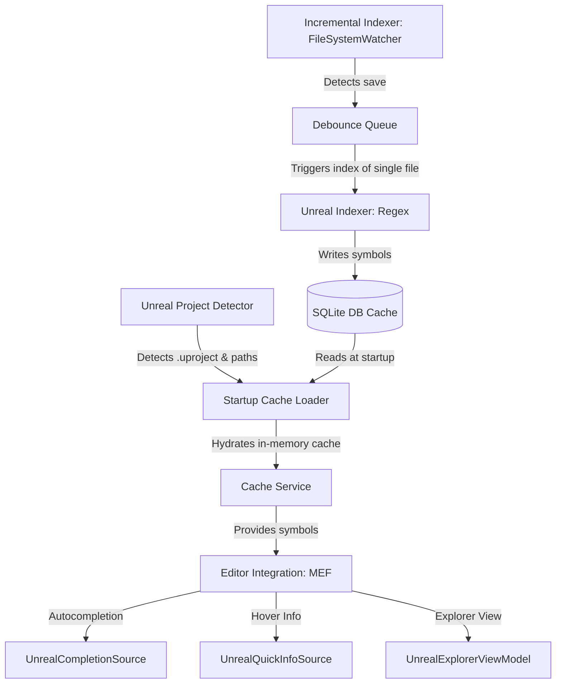

# PenguinExtension

A lightweight and fast Visual Studio 2022 VSIX extension designed for Unreal Engine C++ developers. It provides Rider-like navigation, auto-completion, hover documentation, and a dedicated Symbol Explorer—all powered by a persistent SQLite cache database and asynchronous background indexing that never blocks the editor UI.

---

## Key Features

*   **Fast Autocomplete**: Fast C++ auto-suggestions served directly from a memory-hydrated symbol cache.
*   **Unreal Symbol Explorer**: A dedicated tool window (docked to the left by default) that lists classes, structs, enums, functions, and delegates with inheritance chains.
*   **Go To Unreal Definition**: Quick keyboard shortcut (`Ctrl+Shift+U`, `D`) to navigate directly to the definition of any Unreal symbol.
*   **Hover QuickInfo**: Custom tooltips displaying class hierarchies, function signatures, file locations, and doc-comments.
*   **Zero-Blocking UI**: Background indexing and cache hydration run completely asynchronously.

---

## Architecture Overview



### 1. Persistence Layer (`Database/`)
The extension maintains a local SQLite database (`penguin_cache.db`) located in the solution's `.vs/PenguinExtension/` folder. It uses **WAL (Write-Ahead Logging)** mode to allow the background thread to write new symbols while the main thread performs read queries concurrently.

### 2. Services (`Services/`)
*   **UnrealProjectDetector**: Checks if the open solution is a UE project (by locating `.uproject`), detects the engine path via the registry, and allows manual paths override under `Tools -> Options`.
*   **CacheService**: Maintains thread-safe in-memory collections of symbols (`ReaderWriterLockSlim`) for instantaneous UI/completion response times.
*   **UnrealIndexer**: A throttled parallel regex-based scanner that parses source headers (`.h` / `.hpp`) for `UCLASS`, `USTRUCT`, `UENUM`, `UFUNCTION`, `UPROPERTY`, and custom delegates.
*   **IncrementalIndexer**: A `FileSystemWatcher`-based observer that watches the project's source directory and triggers debounced single-file re-indexing on file saves.

### 3. Editor UI & MEF (`Completion/`, `QuickInfo/`, `UI/`)
*   **MEF Completion Provider**: Hooks into VS's modern `IAsyncCompletionSource` subsystem to overlay our cached suggestions onto C++ IntelliSense.
*   **Unreal Symbol Explorer**: A custom WPF tool window showing flat list browsing and filters.

---

## Development Setup

### Prerequisites
1.  **Visual Studio 2022** (Community, Professional, or Enterprise).
2.  **Visual Studio Extension Development** workload (install via Visual Studio Installer).
3.  **.NET Framework 4.7.2 SDK**.
4.  **Unreal Engine (4.27, 5.x, or 6.x)** source code/installation on the same machine.

### Getting Started Workflow
1.  **Clone the Repository**:
    ```bash
    git clone https://github.com/jahidjay/PenguinExtension.git
    cd PenguinExtension
    ```
2.  **Restore Packages**:
    Run package restore on the solution:
    ```bash
    dotnet restore PenguinExtention.sln
    ```
3.  **Open in Visual Studio**:
    Open `PenguinExtention.sln` inside Visual Studio 2022.
4.  **Run & Debug (Experimental Instance)**:
    *   Set `PenguinExtention` as the Startup Project.
    *   Press **F5** (or `Debug -> Start Debugging`).
    *   This will launch an **Experimental Instance of Visual Studio 2022** (`devenv.exe /rootsuffix Exp`) with the extension automatically installed.
    *   Open any Unreal Engine C++ project inside this experimental instance to test.

---

## Project Directory Structure

```text
PenguinExtension/
├── Commands/                    # Menu commands & shortcuts (Go to definition, open window)
├── Completion/                  # MEF auto-completion providers (IAsyncCompletionSource)
├── Database/                    # SQLite database persistence layer (SQLiteCache.cs)
├── Models/                      # Symbol representations (UnrealSymbol, IndexedFile, etc.)
├── Properties/                  # Assembly info & VS extension attributes
├── QuickInfo/                   # Hover tooltip providers (IAsyncQuickInfoSource)
├── Services/                    # Core background tasks (detector, indexer, watcher)
├── UI/                          # WPF XAML Control, ViewModel, and ToolWindow wrapper
├── PenguinExtention.csproj      # Legacy VSIX project definition
├── PenguinExtention.sln         # Visual Studio Solution wrapper
├── PenguinExtention.vsct        # VS command table definition XML
└── source.extension.vsixmanifest# VSIX extension metadata & targets
```

---

## Contributing and Collaborating

When contributing code changes, please stick to the following workflows:

1.  **Create a Feature Branch**:
    ```bash
    git checkout -b feature/your-awesome-feature
    ```
2.  **Ensure Code Quality**:
    Ensure the extension compiles cleanly under Debug configurations. Avoid synchronous file or database accesses on the UI thread—prefer `Microsoft.VisualStudio.Threading` patterns (`JoinableTaskFactory.SwitchToMainThreadAsync` for UI access, and background threads for SQLite/file interactions).
3.  **Submit a Pull Request**:
    Open a Pull Request describing the changes, testing results, and visual impact if modifying the Unreal Explorer UI.
