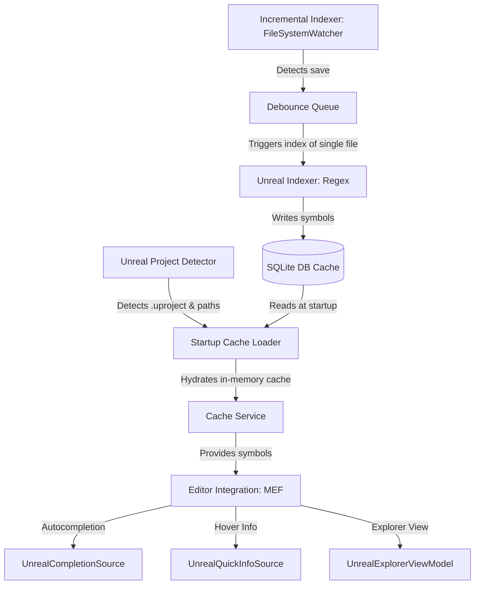

# PenguinExtension / PenguinCore

Unreal Engine reflected-symbol tooling with a shared Rust implementation and thin editor/desktop clients. The existing Visual Studio extension remains available as the Legacy backend while Core integration is validated.

## Components

| Component | Source | Role |
| --- | --- | --- |
| Parser | `crates/ue-parser` | tree-sitter C++ extraction with Unreal reflection macros |
| Storage | `crates/ue-db` | Transactional SQLite cache using WAL |
| Shared service | `crates/ue-core` | Workspace validation, indexing, queries and jobs |
| Style | `crates/ue-style` | Conservative reflection checks, optional naming rules |
| Local AI | `crates/ue-ai` | Bounded, explicit Ollama previews; no autonomous edits |
| LSP | `crates/ue-lsp` | `penguin-lsp`, FULL editor sync and live-buffer overlays |
| MCP | `crates/ue-mcp` | `penguin-mcp`, source-read-only local tools |
| VS Code-compatible | `apps/vscode-ext` | LSP client with bundled native server |
| Visual Studio | Root VSIX + `apps/vs-client` | Legacy/Core backend integration |
| Desktop | `apps/desktop-tauri` | Tauri 2 local workspace browser and previews |

See the [verification ledger](docs/verification.md) for measured results. Component presence or a successful compile is not a claim that every IDE/platform has been tested.

## Build locally

Prerequisites: Rust and a C/C++ compiler, Node.js/npm for TypeScript apps; Visual Studio with extension-development tools and .NET Framework 4.7.2 for the VSIX; platform webview prerequisites for Tauri.

```bash
bash setup_all.sh --check
cargo test --workspace
bash scripts/build-core.sh
python -m unittest discover -s scripts -p 'test_*.py'
```

`setup_all.sh` checks prerequisites without overwriting source, installing toolchains, changing global defaults, or downloading models. Pass `--restore` for an explicit locked Rust dependency fetch.

The headless Rust workspace and native desktop crate have separate build entry points. Build the TypeScript apps from their directories with `npm ci`, `npm run typecheck`, `npm test`, and `npm run build`. Client READMEs describe runtime commands and settings.

For the Visual Studio package, use full MSBuild rather than relying on `dotnet build` for legacy VSSDK targets:

```powershell
pwsh -File scripts/build-vsix.ps1
```

This builds and inspects a local package; it does not install it. Use `-MSBuildPath` to select a specific installed toolchain. The VSIX installation range remains conservative until isolated IDE runtime validation supports widening it.

For VS Code, first build the release server and run `python scripts/stage-vscode-server.py`, then package from `apps/vscode-ext`. Packages need the matching OS/architecture binary; end users should not need Cargo.

## Safety and data boundaries

- Project source stays local. AI is disabled by default and accepts only a loopback Ollama endpoint; no cloud inference, implicit model pulls, or service startup.
- The documented default is `qwen2.5-coder:3b`. Install/select a model deliberately; an absent model is an error, not permission to substitute another.
- AI returns preview text, never shell commands to execute or edits to apply automatically.
- Disk indexing is root-scoped, excludes generated/build/cache directories, rejects unsupported encodings/oversized headers, and does not follow symlinks or junctions.
- Core uses separate cache namespaces and writer ownership. The legacy `.vs/PenguinExtension/penguin_cache.db` is not repurposed.
- Unsaved buffers belong to their LSP session; desktop/MCP results are disk-backed.
- No formatter, compiler-equivalent C++ type/member resolution, or unrestricted refactoring is promised. Unknown/ambiguous facts remain unknown/ambiguous.

## Documentation

- [Thin-client protocol and DTOs](docs/penguin-protocol.md)
- [Build and package helpers](scripts/README.md)
- [Isolated manual acceptance](docs/manual-acceptance.md)
- [Verification ledger and platform limits](docs/verification.md)
- [LSP behavior and tests](crates/ue-lsp/README.md)

## Existing Visual Studio shortcuts

All use the first chord **Ctrl+Shift+U**, then:

| Key | Command |
| --- | --- |
| D | Go To Unreal Definition |
| E | Unreal Explorer |
| I | Generate Implementation |
| G | Generate Getter/Setter |
| S | Symbol Inspector |
| K | Keyboard Shortcuts |

## Legacy Visual Studio backend

The following architecture describes the original C# backend, not the Rust Core backend. Preserve its behavior while testing the explicitly selected Core backend in an experimental IDE profile.

## Architecture Overview


```mermaid
graph TD
    A[Unreal Project Detector] -->|Detects .uproject & paths| B[Startup Cache Loader]
    B -->|Hydrates in-memory cache| C[Cache Service]
    C -->|Provides symbols| D[Editor Integration: MEF]
    D -->|Autocompletion| E[UnrealCompletionSource]
    D -->|Hover Info| F[UnrealQuickInfoSource]
    D -->|Explorer View| G[UnrealExplorerViewModel]
    
    H[Unreal Indexer: Regex] -->|Writes symbols| I[(SQLite DB Cache)]
    I -->|Reads at startup| B
    
    J[Incremental Indexer: FileSystemWatcher] -->|Detects save| K[Debounce Queue]
    K -->|Triggers index of single file| H
```

### 1. Persistence Layer (`Database/`)
The extension maintains a local SQLite database (`penguin_cache.db`) located in the solution's `.vs/PenguinExtension/` folder. It uses **WAL (Write-Ahead Logging)** mode to allow the background thread to write new symbols while the main thread performs read queries concurrently.

### 2. Services (`Services/`)
*   **UnrealProjectDetector**: Checks if the open solution is a UE project (by locating `.uproject`), detects the engine path via the registry, and allows manual paths override under `Tools -> Options`.
*   **CacheService**: Maintains thread-safe in-memory collections of symbols (`ReaderWriterLockSlim`) for instantaneous UI/completion response times.
*   **UnrealIndexer**: A throttled parallel regex-based scanner that parses source headers (`.h` / `.hpp`) for `UCLASS`, `USTRUCT`, `UENUM`, `UFUNCTION`, `UPROPERTY`, and custom delegates.
*   **IncrementalIndexer**: A `FileSystemWatcher`-based observer that watches the project's source directory and triggers debounced single-file re-indexing on file saves.

### 3. Editor UI & MEF (`Completion/`, `QuickInfo/`, `UI/`)
*   **MEF Completion Provider**: Hooks into VS's modern `IAsyncCompletionSource` subsystem to overlay our cached suggestions onto C++ IntelliSense.
*   **Unreal Symbol Explorer**: A custom WPF tool window showing flat list browsing and filters.

---

## Development Setup

### Prerequisites
1.  **Visual Studio 2022** (Community, Professional, or Enterprise).
2.  **Visual Studio Extension Development** workload (install via Visual Studio Installer).
3.  **.NET Framework 4.7.2 SDK**.
4.  **Unreal Engine (4.27, 5.x, or 6.x)** source code/installation on the same machine.

### Getting Started Workflow
1.  **Clone the Repository**:
    ```bash
    git clone https://github.com/jahidjay/PenguinExtension.git
    cd PenguinExtension
    ```
2.  **Restore Packages**:
    Run package restore on the solution:
    ```bash
    dotnet restore PenguinExtention.sln
    ```
3.  **Open in Visual Studio**:
    Open `PenguinExtention.sln` inside Visual Studio 2022.
4.  **Run & Debug (Experimental Instance)**:
    *   Set `PenguinExtention` as the Startup Project.
    *   Press **F5** (or `Debug -> Start Debugging`).
    *   This will launch an **Experimental Instance of Visual Studio 2022** (`devenv.exe /rootsuffix Exp`) with the extension automatically installed.
    *   Open any Unreal Engine C++ project inside this experimental instance to test.

---

## Project Directory Structure

```text
PenguinExtension/
├── Commands/                    # Menu commands & shortcuts (Go to definition, open window)
├── Completion/                  # MEF auto-completion providers (IAsyncCompletionSource)
├── Database/                    # SQLite database persistence layer (SQLiteCache.cs)
├── Models/                      # Symbol representations (UnrealSymbol, IndexedFile, etc.)
├── Properties/                  # Assembly info & VS extension attributes
├── QuickInfo/                   # Hover tooltip providers (IAsyncQuickInfoSource)
├── Services/                    # Core background tasks (detector, indexer, watcher)
├── UI/                          # WPF XAML Control, ViewModel, and ToolWindow wrapper
├── PenguinExtention.csproj      # Legacy VSIX project definition
├── PenguinExtention.sln         # Visual Studio Solution wrapper
├── PenguinExtention.vsct        # VS command table definition XML
└── source.extension.vsixmanifest# VSIX extension metadata & targets
```

---

## Contributing and Collaborating

When contributing code changes, please stick to the following workflows:

1.  **Create a Feature Branch**:
    ```bash
    git checkout -b feature/your-awesome-feature
    ```
2.  **Ensure Code Quality**:
    Ensure the extension compiles cleanly under Debug configurations. Avoid synchronous file or database accesses on the UI thread—prefer `Microsoft.VisualStudio.Threading` patterns (`JoinableTaskFactory.SwitchToMainThreadAsync` for UI access, and background threads for SQLite/file interactions).
3.  **Submit a Pull Request**:
    Open a Pull Request describing the changes, testing results, and visual impact if modifying the Unreal Explorer UI.
